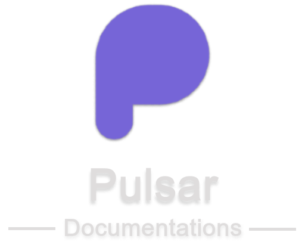
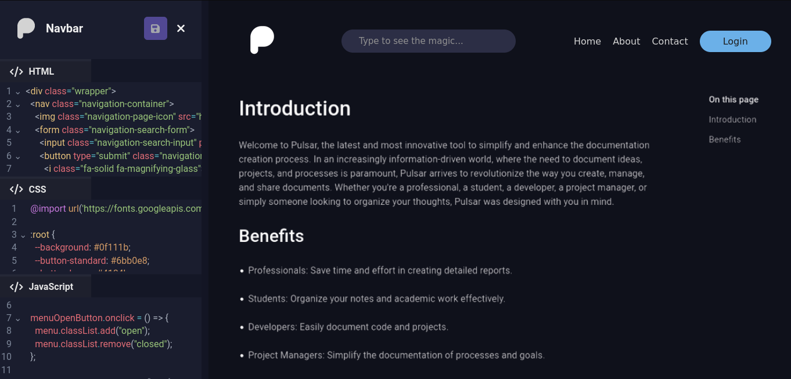

<div align="center">
  
  <br />
  <br />
  
  
  
  
  
  
  
  <br />
  
  
  
  
  
  <br />
  <br />
  
  <h1>🌟 Pulsar - Document Everything</h1>
  <p>A powerful online documentation editor that makes creating beautiful documentation pages effortless.</p>
  <p>Create, customize, and export professional documentation websites with an intuitive visual interface.</p>

  [Getting Started](#-getting-started) •
  [Features](#-features) •
  [Screenshots](#-screenshots) •
  [Installation](#-installation) •
  [Contribute](#-contribute)
  
</div>

---

## 🚀 Getting Started

Pulsar is the ultimate solution for streamlining documentation page creation. With its intuitive interface and powerful features, Pulsar allows you to quickly and efficiently build documentation pages. Organize information, add content effortlessly, and deliver a seamless documentation experience for your users.

**Live Demo:** [https://pulsar.mathschumacher.dev](https://pulsar.mathschumacher.dev)

---

## ✨ Features

<table>
  <tr>
    <td align="center">📝 <strong>Rich Text Editor</strong><br/>Markdown-powered editor with slash commands</td>
    <td align="center">🎨 <strong>Full Customization</strong><br/>Customize colors, styles, and layouts</td>
    <td align="center">💾 <strong>Auto-Save</strong><br/>Never lose your work with auto-save</td>
  </tr>
  <tr>
    <td align="center">📦 <strong>Export Ready</strong><br/>Export as static Vite project</td>
    <td align="center">📥 <strong>Import/Export</strong><br/>Share docs via manifest.json</td>
    <td align="center">👁️ <strong>Live Preview</strong><br/>Preview documentation in real-time</td>
  </tr>
  <tr>
    <td align="center">🔷 <strong>Code Blocks</strong><br/>Syntax-highlighted code blocks</td>
    <td align="center">📊 <strong>Tables</strong><br/>Resizable and editable tables</td>
    <td align="center">🎛️ <strong>Custom Components</strong><br/>Create navbars, footers with HTML/CSS/JS</td>
  </tr>
</table>

### Editor Capabilities
- **Slash Commands** - Type `/` to access quick commands for adding tables, code blocks, images, and more
- **Markdown Support** - Full markdown syntax support for formatting
- **Code Blocks** - Syntax highlighting for multiple programming languages
- **Tables** - Create and resize tables with ease
- **Categories & Pages** - Organize documentation into categories and pages
- **Indexes Table** - Auto-generated table of contents

### Customization Features
- **Color Palette** - Customize all colors including background, primary, secondary, text, and code block colors
- **Custom Components** - Create custom HTML/CSS/JS components for headers, footers, sidebars
- **Multiple Regions** - Place customizations in top, bottom, left, or right regions

### Export Options
- **Static Site Export** - Export as a Vite-powered static website
- **Manifest Export** - Export/import documentation via JSON manifest

---

## 📸 Screenshots

<div align="center">
  
  <p><em>Rich text editor with live typing preview</em></p>
</div>

<div align="center">
  
  <p><em>Customization editor for creating custom components</em></p>
</div>

---

## 🛠️ Installation

### Prerequisites
- Node.js 18+ 
- pnpm (recommended) or npm

### Clone the Repository

```bash
git clone https://github.com/MathSchumacher/Pulsar-Document-Everything.git
```

### Navigate to Project Directory

```bash
cd Pulsar-Document-Everything
```

### Install Dependencies

```bash
pnpm install
```

### Run Development Server

```bash
pnpm dev
```

Open [http://localhost:3000](http://localhost:3000) in your browser.

### Build for Production

```bash
pnpm build
```

### Preview Production Build

```bash
pnpm preview
```

---

## 📋 Project Roadmap

### Completed
- [x] Create and host documentations on Pulsar - v2.0.0
- [x] Custom color palettes for documentation
- [x] Export as static Vite project
- [x] Import/export via manifest.json
- [x] Custom HTML/CSS/JS components
- [x] Internationalization (English & Portuguese)

### In Progress
- [ ] Implement TDD for API routes
- [ ] Create Pulsar's own markdown editor (remove Tiptap dependency)
- [ ] Add note blocks to the editor
- [ ] Upgrade table usability and customization

### Planned
- [ ] Remove PrimeVue components causing mobile lag
- [ ] Upgrade editor page interface
- [ ] Upgrade customizations page interface
- [ ] Add page search feature in navigation menu
- [ ] Create templates area for faster documentation creation
- [ ] Integrate editor with AI assistance

---

## 🤝 Contribute

Contributions are welcome! To contribute:

1. Fork the repository
2. Create your feature branch (`git checkout -b feature/AmazingFeature`)
3. Commit your changes (`git commit -m 'Add some AmazingFeature'`)
4. Push to the branch (`git push origin feature/AmazingFeature`)
5. Open a Pull Request

---

## 📄 License

This project is licensed under the MIT License - see the [LICENSE](LICENSE) file for details.

---

## 👨‍💻 Author

**Matheus Schumacher**

- GitHub: [@MathSchumacher](https://github.com/MathSchumacher)
- Email: matheusmschumacher@gmail.com

---

<div align="center">
  <p>Made with ❤️ using Vue.js, Nuxt.js, and TypeScript</p>
  <p>⭐ Star this repository if you find it helpful!</p>
</div>
